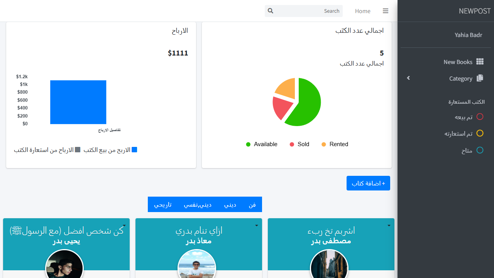
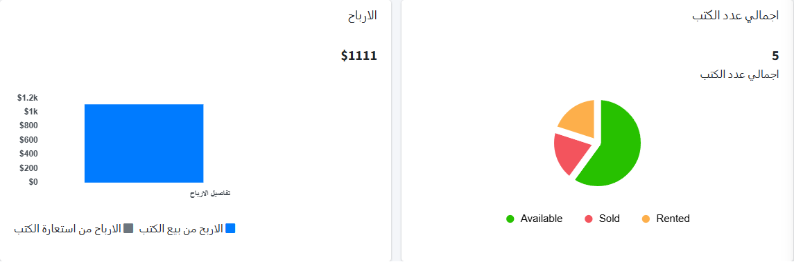
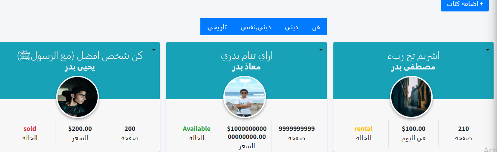

<div align="center">
  
  <br/>
  
  <p align="center">
    <a href="#"></a>
    <a href="#"></a>
    <a href="#"></a>
    <a href="#"></a>
    <a href="#"></a>
  </p>
  <h1>library-lms</h1>
  <p>
    A full-featured <strong>Library Management System</strong> built with <strong>Django</strong>, <strong>HTML</strong>, <strong>CSS</strong>, and <strong>JavaScript</strong>.  
    It offers seamless book tracking, rental management, sales reporting, and an interactive dashboard.
  </p>
</div>

---

## Overview

**library-lms** is a dynamic and responsive web application designed to streamline library operations — from book rentals and sales to inventory and category management. The system includes multi-language support and real-time insights through an intuitive dashboard.

---

## Key Features

- **Dashboard**  
  Visual summaries of total books, categories, and financial reports.

- **Book Management**  
  Add, search, categorize, and track books.

- **Rental & Sales System**  
  Separate tracking for sold and rented books — with live revenue stats.

- **User Profiles**  
  Avatars, rental history, and daily rental pricing.

- **Status Overview**  
  Easily see which books are:
  - ✅ Available (متاح)
  - 📦 Sold (تم بيعه)
  - 📖 Rented (تم استعارته)

- **Category Tagging**  
  Tag books by genre (e.g., ديني, نفسي, تاريخي, فن).

- **Language Support**  
  Interface includes English and Arabic sections.

---

## Tech Stack

- **Backend**: Django (Python)
- **Frontend**: HTML, CSS, JavaScript
- **Database**: SQLite

---

## Interface Highlights

| Dashboard Summary | Book Detail View | 
|-------------------|------------------|
|  |  |

---

## Getting Started

1. **Clone the repository**  
   ```bash
   git clone https://github.com/Black4315/library-lms.git
   ``` 

2. **Install dependencies**  
   ```bash
   pip install -r requirements.txt
   ``` 

3. **Run migrations**  
   ```bash
   python manage.py migrate
   ``` 
4. **Start development server**  
   ```bash
   python manage.py runserver
   ``` 
5. **Visit http://127.0.0.1:8000/**  
---


## Contact

Available for freelance projects and product collaborations.

Email: **[yahialord4315@gmail.com](mailto:yahialord4315@gmail.com)**  
Portfolio: **[https://portfolio25-one.vercel.app](https://portfolio25-one.vercel.app)**

---

## License

MIT License © 2025 Yahia Badr